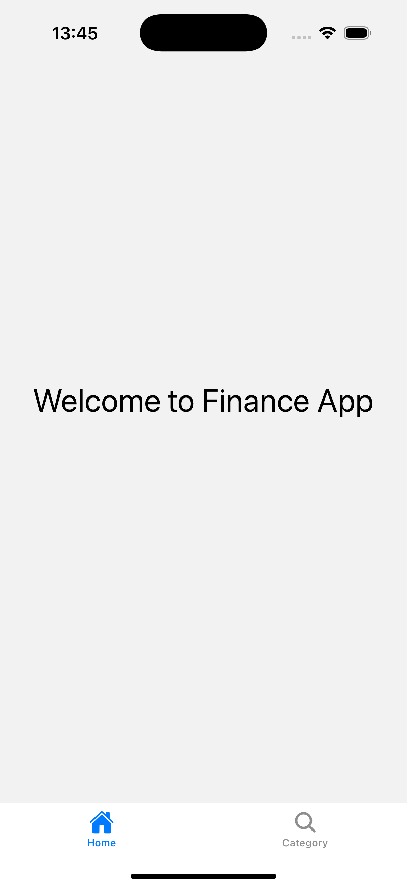
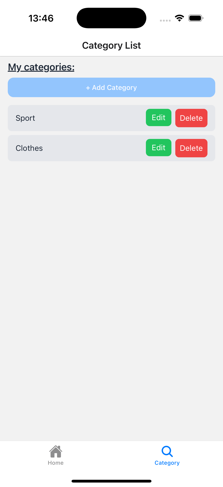
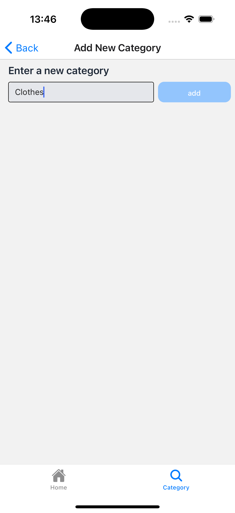

# Monorepo: NestJS + React Native (TypeScript)

This monorepo includes:
- **backend**: [NestJS](https://docs.nestjs.com/) application
- **frontend**: [React Native](https://reactnative.dev/) (TypeScript) application

To run the project, you need to have the following tools installed:
Run pnpm install in the root directory
```bash
pnpm install
```
## Backend
run the following command in the backend directory
```bash
pnpm run start:dev
```
and install docker and docker-compose then run the following command in the backend directory
```bash
docker-compose up
```
## Frontend
run the following command in the frontend directory
```bash
expo start
```

- **backend**: [Docker](https://www.docker.com/) and [Docker Compose](https://docs.docker.com/compose/)
- **frontend**: [Expo CLI](https://docs.expo.dev/workflow/expo-cli/)


## Categories
<div style="display: flex; gap: 10px;">
  
  
  
</div>