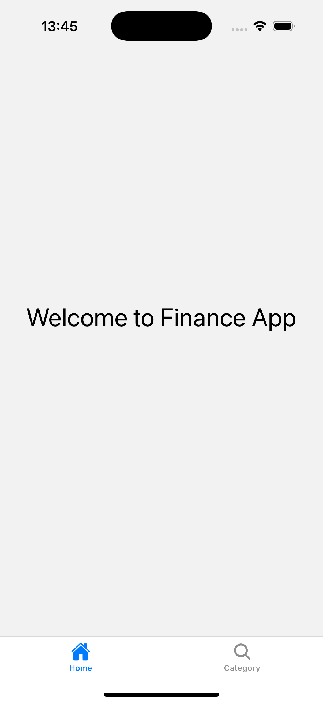
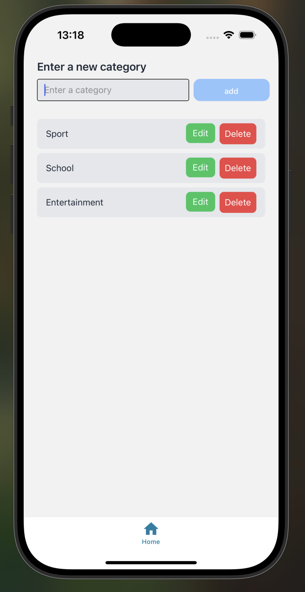

# Monorepo: NestJS + React Native (TypeScript)

This monorepo includes:
- **backend**: [NestJS](https://docs.nestjs.com/) application
- **frontend**: [React Native](https://reactnative.dev/) (TypeScript) application

## Categories

  
  

